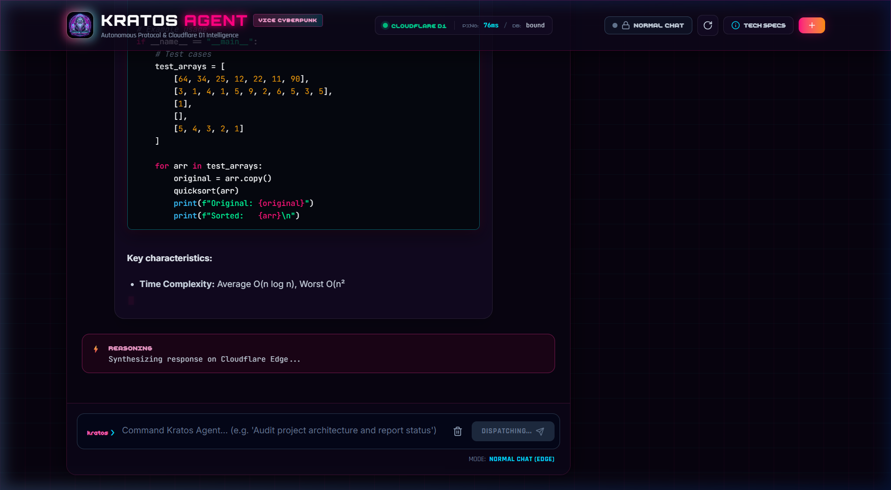

<div align="center">


# ⚔️ KRATOS AGENT // VICE CYBERPUNK EDITION

### *"Do not be sorry. Be better."* — Ghost of Sparta

**Autonomous Full-Stack AI Coding Agent featuring Universal LLM Brain, Real-Time Token Streaming, Dynamic Step Planning, Self-Forging Tool Engine, Multi-Session D1 Memory, and Senior Claude Code Engineering Workflows.**

[](https://www.python.org/)
[](https://github.com/astral-sh/uv)
[](https://vitejs.dev/)
[](https://workers.cloudflare.com/)
[](LICENSE)
[](https://github.com/Piebald-AI/claude-code-system-prompts)
[](#-skills-ecosystem)
[](#-testing--quality-assurance)

[🌐 Live Cloudflare Web Version](https://kratos-agent.thirutechdeveloper.workers.dev) • [🎮 Quickstart](#-quickstart-cli-version-vs-web-version) • [🖥️ CLI Version](#️-cli-version-usage) • [🌐 Web Version](#-web-version-usage) • [📜 Slash Commands](#-complete-cli-slash-commands-reference)

</div>

---

## 📑 Table of Contents

- [⚡ Overview](#-overview)
- [🎮 Quickstart: CLI Version vs Web Version](#-quickstart-cli-version-vs-web-version)
  - [🖥️ 1. CLI Version (Terminal Shell & One-Shot Mode)](#️-1-cli-version-terminal-shell--one-shot-mode)
  - [🌐 2. Web Version (Vice City Cyberpunk Console)](#-2-web-version-vice-city-cyberpunk-console)
  - [☁️ 3. Cloudflare Edge Version (Live Serverless Web App)](#️-3-cloudflare-edge-version-live-serverless-web-app)
- [🚀 Key Features](#-key-features)
- [🧠 The Brain Subsystem & Streaming Gateway](#-the-brain-subsystem--streaming-gateway)
- [⚙️ Architecture & Execution Pipeline](#️-architecture--execution-pipeline)
- [📦 Installation & Environment Setup](#-installation--environment-setup)
- [🔑 Configuration & Environment Variables (.env)](#-configuration--environment-variables-env)
- [🖥️ Standalone Windows Executable (.exe)](#️-standalone-windows-executable-exe)
- [📜 Complete CLI Slash Commands Reference](#-complete-cli-slash-commands-reference)
- [🛡️ Execution & Approval Modes](#️-execution--approval-modes)
- [🗡️ Autonomous Tool Forging](#️-autonomous-tool-forging)
- [🧪 Testing & Quality Assurance](#-testing--quality-assurance)
- [🏗️ Directory Structure](#️-directory-structure)
- [🛡️ License](#️-license)

---

## ⚡ Overview

**Kratos Agent** is a dual-interface autonomous AI coding agent designed for senior developer workflows, workspace mutation, and shell execution. It operates both as a high-octane **Interactive Terminal CLI** and as a **Vice City Cyberpunk Web Console** with true real-time token-by-token streaming, Cloudflare D1 persistence, and live tool orchestration.

Equipped with the complete **Claude Code System Prompts & Sub-Agents suite** (695+ indexed prompts, workflows, and sub-agents), Kratos delivers:
- **True Autonomous Planning**: Breaks complex tasks into verifiable sub-goals with dynamic state machines (`PENDING` → `RUNNING` → `COMPLETED`).
- **Real-Time Token Streaming**: True SSE incremental token streaming across both local Python runtime and Cloudflare Edge Worker (`cloudflare:sockets`).
- **Workspace File Operations**: Inspects, searches, creates, and surgical-edits files with localized context.
- **Terminal Execution & Verification**: Executes tests, compiles code, runs linters, and verifies deliverables before completing turns.
- **Self-Forging Tool Engine**: Synthesizes and hot-reloads new Python tools at runtime when needed.
- **Persistent Multi-Session Memory**: Isolated local SQLite session files and Cloudflare D1 database storage.

---

## 🎮 Quickstart: CLI Version vs Web Version

Kratos Agent can be launched in **CLI Mode** for terminal enthusiasts or **Web Mode** for a rich graphical experience:

```
                               ┌─────────────────────────────┐
                               │     uv run kratos / CLI     │
                               └──────────────┬──────────────┘
                                              │
                     ┌────────────────────────┴────────────────────────┐
                     ▼                                                 ▼
        ┌───────────────────────────┐                     ┌───────────────────────────┐
        │   🖥️  CLI VERSION         │                     │   🌐  WEB VERSION         │
        │   uv run kratos --cli     │                     │   uv run kratos           │
        ├───────────────────────────┤                     ├───────────────────────────┤
        │ • Interactive prompt shell│                     │ • Vice Cyberpunk 2077 UI  │
        │ • Live Task Tree TUI      │                     │ • Live Token Streaming    │
        │ • 30+ Slash Commands      │                     │ • Agent & Normal Chat     │
        │ • Approval Gates          │                     │ • D1 Intelligence & SQL   │
        │ • Direct 1-shot execution │                     │ • Code Highlighter + Copy │
        └───────────────────────────┘                     └───────────────────────────┘
```

---

### 🖥️ 1. CLI Version (Terminal Shell & One-Shot Mode)

The CLI version runs directly in your terminal with animated step trees, syntax highlighting, and slash commands:

#### A. Interactive Shell Mode
Start the interactive prompt_toolkit shell:
```bash
# Recommended command:
uv run kratos --cli

# Alternative alias:
uv run kratos-agent --cli
```
Inside the interactive shell:
- Type your prompt and press **Enter** to start autonomous execution.
- Use **Tab** to autocomplete commands and file paths.
- Attach files to prompts with `@filename` (e.g. `explain the architecture of @server.py`).
- Run slash commands like `/session`, `/review`, `/simplify`, `/security`, `/model`, `/mode`.

#### B. Direct One-Shot Command Execution
Pass a prompt directly to execute without entering the interactive shell:
```bash
# Run a one-shot coding task:
uv run kratos "Audit src/kratos_agent/brain for error handling and write unit tests"

# Build a full web application:
uv run kratos "Create a full-stack Flask application in ./demo with JWT auth and SQLite"
```

---

### 🌐 2. Web Version (Vice City Cyberpunk Console)

The Web version runs a local server connecting the Python runtime with the React 19 / Vite Vice City Cyberpunk web interface:

<div align="center">

</div>

#### A. Starting the Web Server
```bash
# Start the Web Console (opens your default browser at http://127.0.0.1:7860 automatically):
uv run kratos

# Or explicitly pass the --web flag:
uv run kratos --web

# Custom port (e.g., port 8080):
uv run kratos --web 8080
```

#### B. Web Console Features
- **Vice City Cyberpunk Aesthetic**: High-energy neon magenta, cyan, and purple theme, CRT scanline effects, and custom `Pixl` font typography.
- **Dual Execution Modes**:
  - 🛡️ **Autonomous Agent Mode**: Protected by security clearance (Passcode: `kratos`). Executes multi-step autonomous planning, shell commands, file modifications, and live verification.
  - 💬 **Normal Chat Mode**: Fast unrestricted technical conversation with live model streaming.
- **Real-Time Token Streaming**: Server-Sent Events (SSE) deliver tokens live as the model generates them.
- **Code Highlighter**: Complete Highlight.js syntax highlighting with language detection and 1-click clipboard copy.
- **Cloudflare D1 Intelligence**: Live turn telemetry, active session switcher, trace visualizer, and an interactive **SQL Playground** for querying the database.
- **100% Responsive**: Built with responsive desktop, tablet, and mobile layouts with compact navigation drawers.

---

### ☁️ 3. Cloudflare Edge Version (Live Serverless Web App)

Kratos Agent is also deployed to Cloudflare Workers with serverless edge streaming and Cloudflare D1 database:

- **Live URL**: [https://kratos-agent.thirutechdeveloper.workers.dev](https://kratos-agent.thirutechdeveloper.workers.dev)

#### Deploying Your Own Cloudflare Worker:
```bash
# 1. Build the frontend production assets
npm run build --prefix frontend

# 2. Deploy worker script and static assets to Cloudflare Workers
npx wrangler deploy
```

The edge worker (`worker.js`) features:
- **`cloudflare:sockets` TCP Streaming**: Connects directly to model gateways on non-standard ports (e.g., OmniRoute port `20128`), parsing chunked HTTP/1.1 and SSE tokens on-the-fly.
- **Cloudflare D1 SQL Database**: Persists all chat sessions, turns, tool executions, and commands to serverless SQLite.
- **Static Asset Serving**: Serves the Vite React production bundle directly from Cloudflare's global edge network.

---

## 🚀 Key Features

| Capability | CLI Version | Web Version | Cloudflare Edge | Description |
| :--- | :---: | :---: | :---: | :--- |
| ⚡ **Live Token Streaming** | ✅ | ✅ | ✅ | True real-time token-by-token output with zero artificial batch delays. |
| 📋 **Dynamic Step Planner** | ✅ | ✅ | ✅ | Formulates multi-phase task trees with real-time state tracking. |
| 💬 **Normal Chat Mode** | ✅ | ✅ | ✅ | Quick, unrestricted answers and code generation without tool execution. |
| 🛡️ **Autonomous Agent Mode** | ✅ | ✅ | ✅ | Full autonomous file inspection, execution, and verification. |
| 🗡️ **Autonomous Tool Forging** | ✅ | ✅ | ─ | Dynamically writes and hot-reloads new Python tools at runtime. |
| 📁 **Multi-Session Memory** | ✅ | ✅ | ✅ | Isolated multi-turn history with instant switching and persistence. |
| 📊 **D1 Database Console** | ─ | ✅ | ✅ | SQL Playground and telemetry for inspecting agent database records. |
| 🎨 **Highlighter.js Code Box** | Rich | ✅ | ✅ | Beautiful code blocks with syntax highlighting and 1-click copy. |
| 🔍 **Senior Engineering Workflows**| ✅ | ✅ | ✅ | `/review`, `/simplify`, and `/security` sweeps powered by 695+ Claude Code prompts. |
| 📱 **Responsive Layout** | Terminal | ✅ | ✅ | Optimized layouts across desktop (1536px), tablet (768px), and mobile (375px). |

---

## 🧠 The Brain Subsystem & Streaming Gateway

The **Brain** subsystem (`src/kratos_agent/brain/`) provides the LLM engine for Kratos Agent:

```
┌─────────────────────────────────────────────────────────────┐
│                 Kratos Interfaces (CLI / Web)               │
└──────────────────────────────┬──────────────────────────────┘
                               │
┌──────────────────────────────▼──────────────────────────────┐
│                    Kratos Runtime Pipeline                  │
│       (ContextBuilder · InstructionEngine · AgentLoop)      │
└──────────────────────────────┬──────────────────────────────┘
                               │
┌──────────────────────────────▼──────────────────────────────┐
│                     BrainAdapter & Brain                    │
│   ┌─────────────────────────────────────────────────────┐   │
│   │ BrainChatModel (LangChain BaseChatModel)            │   │
│   │ Universal Multi-Format Tool Call Extractor          │   │
│   │   • Harmony / OpenAI OSS commentary format          │   │
│   │   • Hermes / Qwen / Claude XML format (<tool_call>) │   │
│   │   • Markdown JSON tool blocks & Standard format     │   │
│   └──────────────────────────┬──────────────────────────┘   │
│                              │                              │
│   ┌──────────────────────────▼──────────────────────────┐   │
│   │ BrainClient (HTTP Session / trust_env=False)        │   │
│   │   • SSE Incremental Streaming (on_chunk callback)   │   │
│   │   • Request Retries & Exponential Backoff           │   │
│   │   • Latency & TTFT Tracker                          │   │
│   └──────────────────────────┬──────────────────────────┘   │
└──────────────────────────────┼──────────────────────────────┘
                               │
┌──────────────────────────────▼──────────────────────────────┐
│       Brain Gateway / OmniRoute / OpenAI Endpoint           │
│           (http://138.252.100.105:20128/v1)                 │
└─────────────────────────────────────────────────────────────┘
```

### Multi-Format Tool Calling Support
The Brain extractor automatically parses tool invocations across diverse model output styles:
1. **Harmony / OpenAI OSS / ChatML**:
   ```text
   <|start|>assistant<|channel|>commentary to=call:write_file
   <|constrain|>json<|message|>{"file_path": "app.py", "content": "..."}<|call|>
   ```
2. **Hermes / Qwen / Claude XML**:
   ```xml
   <tool_call>
   {"name": "write_file", "arguments": {"file_path": "app.py", "content": "..."}}
   </tool_call>
   ```
3. **Standard Kratos Call**:
   ```text
   call:write_file{"file_path": "app.py", "content": "..."}
   ```
4. **Markdown JSON Tool Blocks**:
   ````json
   {"name": "write_file", "arguments": {"file_path": "app.py", "content": "..."}}
   ````

---

## ⚙️ Architecture & Execution Pipeline

When a user submits a prompt, Kratos executes a structured, multi-phase autonomous loop:

```
[User Request] 
      │
      ▼
1. [Intent Classification] ──── (Chat / Question / Autonomous Engineering Task)
      │
      ▼
2. [Dynamic Planning] ───────── (Formulates Task Items & Live State Tree)
      │
      ▼
3. [Context Assembly] ───────── (System Prompts + Session Memory + Tools + File Context)
      │
      ▼
4. [LLM Brain Streaming] ────── (Streams tokens live & parses tool calls incrementally)
      │
      ▼
5. [Approval Gate Check] ────── (suggest / auto-edit / full-auto permission audit)
      │
      ▼
6. [Tool Execution] ─────────── (write_file, edit_file, run_terminal_command, etc.)
      │
      ▼
7. [Verification Manager] ───── (Syntax validation, test suites, git diff checks)
      │
      ▼
8. [Task Completion & Memory] ─ (Persists to local SQLite / Cloudflare D1 & presents result)
```

---

## 📦 Installation & Environment Setup

### Prerequisites
- **Python 3.10+** (Python 3.14 recommended)
- **uv** package manager ([astral.sh/uv](https://github.com/astral-sh/uv))
- **Node.js 18+** (for frontend builds & Cloudflare deployment)

### 1. Clone & Install Dependencies
```bash
# Clone the repository
git clone https://github.com/Thirumalai-Tech-Developer/Kratos_Agent.git
cd Kratos_Agent

# Sync all Python dependencies with uv
uv sync

# Install frontend dependencies
cd frontend && npm install && cd ..
```

### 2. Configure Environment Variables
Copy `.env.example` to `.env` and set your credentials:
```bash
cp .env.example .env
```
Edit `.env`:
```env
CHAT_ENDPOINT="http://138.252.100.105:20128/v1/chat/completions"
MODEL_ENDPOINT="http://138.252.100.105:20128/v1/models"
OMNI_KEY="Your_API_Key"
BRAIN_BASE_URL="http://138.252.100.105:20128/v1"
BRAIN_MODEL="ds-web/DeepSeek-V3.2"
NORMAL_MODE_MODEL="ds-web/DeepSeek-V3.2"
AGENT_PASSWORD="kratos"
```

### 3. Launch Kratos
```bash
# Start the Web Console:
uv run kratos

# Start the Interactive Terminal CLI:
uv run kratos --cli
```

---

## 🔑 Configuration & Environment Variables (.env)

| Variable | Default Value | Description |
| :--- | :--- | :--- |
| `CHAT_ENDPOINT` | `http://138.252.100.105:20128/v1/chat/completions` | Direct chat completions URL for LLM requests |
| `MODEL_ENDPOINT` | `http://138.252.100.105:20128/v1/models` | Endpoint URL to query available model IDs dynamically |
| `OMNI_KEY` / `BRAIN_KEY` | `""` | API key / Bearer token for model gateway authentication |
| `BRAIN_BASE_URL` | `http://138.252.100.105:20128/v1` | Base URL for OpenAI-compatible gateway |
| `BRAIN_MODEL` | `ds-web/DeepSeek-V3.2` | Active default LLM model for Agent Mode |
| `NORMAL_MODE_MODEL` | `ds-web/DeepSeek-V3.2` | Active LLM model for Normal Chat Mode |
| `AGENT_PASSWORD` | `kratos` | Security clearance passcode to unlock Agent Mode in the Web UI |
| `BRAIN_TIMEOUT` | `60.0` | Request timeout in seconds |
| `BRAIN_MAX_RETRIES` | `2` | Maximum retry attempts on transient network errors |
| `KRATOS_APPROVAL_MODE` | `full-auto` | Default approval mode (`suggest`, `auto-edit`, `full-auto`) |

---

## 🖥️ Standalone Windows Executable (.exe)

You can compile Kratos Agent into a standalone Windows `.exe` binary that runs anywhere without Python installed:

```powershell
# Option A: Build using uv and python
uv run python build_exe.py

# Option B: Run the PowerShell build script
.\build_exe.ps1

# Option C: Run batch script on Command Prompt
build.bat
```

The compiled standalone executable is saved to:
```
dist/kratos-agent.exe
```

---

## 📜 Complete CLI Slash Commands Reference

Inside the interactive Kratos shell (`uv run kratos --cli`), the following slash commands are available:

### 🔧 Diagnostics & Model Configuration
- `/doctor` (alias: `/health`): Runs a full diagnostic check on Brain connection, model responsiveness, and tool registry health.
- `/gateway` (alias: `/accounts`): Displays active Brain gateway URLs, timeout settings, proxy bypass status, and loaded models.
- `/model [name]`: Interactively switch active LLM using arrow keys or by specifying a model name (e.g. `/model ds-web/DeepSeek-V3.2`).

### 📁 Memory & Session Management
- `/session`: Lists all active and saved sessions in `.kratos/sessions/`.
- `/session new [name]`: Creates and switches to a fresh, isolated workspace session.
- `/session load <id>`: Loads an existing session and restores conversation and planning history.
- `/session rm <id>`: Deletes a stored session.
- `/memory`: Displays summary of current session turns, executed tools, and changed files.
- `/compact` (alias: `/compress`): Compresses conversation history to optimize LLM context window tokens.
- `/reset`: Clears multi-turn memory in the active session.

### 🔍 Senior Engineering Sweeps
- `/review [file|target]`: Runs a multi-angle Senior Code Review (security, performance, edge cases, maintainability).
- `/simplify [file|target]`: Runs a 4-angle code cleanup, dead-code removal, and refactoring sweep.
- `/security [file|target]`: Performs a high-confidence vulnerability, injection, and exploit audit.
- `/prompts [query]`: Searches and browses the index of 695+ Claude Code system prompts and sub-agents.

### 🗡️ Tools & Skills
- `/create-tool <description>`: Autonomously writes and hot-reloads a new Python tool in `src/kratos_agent/utils/tools.py`.
- `/tools`: Displays all registered tools, schemas, and self-forged capabilities.
- `/skill list`: Lists all installed skills and knowledge modules.
- `/skill add <url|topic>`: Downloads and installs a skill from a URL or internet topic.
- `/skill show <name>`: Displays cheatsheets and instructions for a specific skill.
- `/skill remove <name>`: Uninstalls an active skill.
- `/reload` (alias: `/r`): Live hot-reloads all Python modules, tools, and skills without restarting Kratos.

### 🏃 Background Tasks
- `/bg-run <prompt>`: Spawns an asynchronous background task.
- `/bg-status`: Lists active background tasks and execution status.
- `/bg-result <id>`: Displays the logs and output of a completed background task.
- `/bg-cancel <id>`: Cancels a running background task.

### 🛠️ Debugging & Inspection
- `/context`: Prints the exact redacted JSON request payload sent to the LLM (system instructions, memory, tool schemas).
- `/debug`: Displays step logs, execution timings, token metrics, and event history.
- `/debug live`: Toggles the live TUI step display on/off.
- `/clear`: Clears the terminal screen.
- `/help`: Displays the commands quick-reference overview.
- `/exit` (alias: `/quit`): Exits Kratos Agent.

---

## 🛡️ Execution & Approval Modes

Control how much autonomy Kratos has when interacting with files and terminal commands via `/mode`:

```
/mode [suggest | auto-edit | full-auto]
```

1. **`suggest` (Read-Only / Safe Mode)**:
   - Kratos can read files and inspect the workspace.
   - All file modifications and shell commands require explicit manual approval.
2. **`auto-edit` (Balanced Developer Mode)**:
   - Kratos automatically writes and edits code files (`write_file`, `edit_file`).
   - Terminal shell executions (`run_terminal_command`) prompt for user confirmation.
3. **`full-auto` (Ghost of Sparta Mode)**:
   - Full autonomous execution.
   - Kratos creates files, modifies code, runs commands, executes tests, and verifies deliverables end-to-end without interrupting for approval.

---

## 🗡️ Autonomous Tool Forging

If a task requires an unsupported capability (e.g. image resizing, database migrations, specific API calls), Kratos can forge its own tools at runtime:

```bash
kratos ❯ /create-tool "create a tool to convert webp images to png using pillow"
```

1. Kratos writes a validated Python function to [`src/kratos_agent/utils/tools.py`](src/kratos_agent/utils/tools.py).
2. It registers the JSON schema in [`src/kratos_agent/utils/tools_list.json`](src/kratos_agent/utils/tools_list.json).
3. The [`CodeReloader`](src/kratos_agent/core/reloader.py) instantly hot-reloads the tool into the active session without restarting the agent.

---

## 🧪 Testing & Quality Assurance

Kratos Agent includes a complete automated test suite covering configuration, transport, tool parsing, planners, and latency tracking:

```bash
# Run unit tests
uv run python -m unittest discover tests

# Or run specific test modules:
uv run python -m unittest tests/test_brain_config.py
uv run python -m unittest tests/test_brain_transport.py
uv run python -m unittest tests/test_planner.py
uv run python -m unittest tests/test_runtime.py
```

---

## 🏗️ Directory Structure

```
Kratos_Agent/
├── .env                        # Brain Gateway & Model Environment Config
├── .env.example                # Example environment template
├── kratos_banner.png           # Vice City Cyberpunk Master Banner Image
├── README.md                   # Project Documentation
├── pyproject.toml              # Project Manifest & CLI Entry Points (`kratos`, `kratos-agent`)
├── package.json                # Root package for Cloudflare CI/CD & Vite build scripts
├── worker.js                   # Cloudflare Edge Worker Runtime (TCP Sockets + Streaming + D1)
├── wrangler.json               # Cloudflare Workers & D1 Deployment Configuration
├── frontend/                   # Modern React 19 + Vite 8 Vice City Cyberpunk Web App
│   ├── src/
│   │   ├── App.jsx             # Main Application Arena & Real-Time Chat Engine
│   │   ├── components/         # Navbar, AgentHud, SqlPlayground, TraceReplay, etc.
│   │   └── index.css           # Vice Cyberpunk design system & custom Pixl font
│   ├── dist/                   # Production Web Bundle (served by local server & Cloudflare)
│   └── vite.config.js          # Vite build configuration
├── src/
│   └── kratos_agent/
│       ├── cli.py              # Interactive prompt_toolkit CLI & Web Launcher
│       ├── main.py             # KratosRuntime Engine
│       ├── brain/              # Universal LLM Brain Subsystem
│       │   ├── client.py       # Proxy-Free BrainClient with SSE Streaming
│       │   ├── chat_model.py   # Multi-Format Tool Calling Extractor
│       │   └── config.py       # Gateway Config & Environment Resolution
│       ├── core/               # Autonomous Engine Core
│       │   ├── agent_loop.py   # Multi-Step Autonomous Execution Loop
│       │   ├── memory.py       # Multi-Session Agent Memory Engine
│       │   ├── planner.py      # Strategic Planning & Intent Classifier
│       │   └── task_manager.py # State Machine & Task Tree Manager
│       ├── web/
│       │   └── server.py       # Python HTTP Web Console & API Server
│       └── utils/              # Self-Healing Tool Registry
│           ├── tool_creator.py # Autonomous Tool Forger & Synthesizer
│           └── tools.py        # Core Builtin & Forged Tools
└── tests/                      # Automated Test Suite
```

---

## 🛡️ License

This project is licensed under the **MIT License**. See the [LICENSE](LICENSE) file for details.
