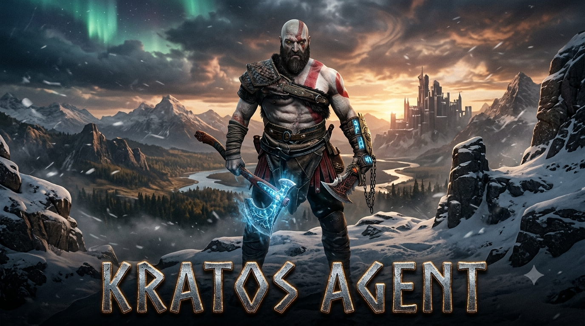

<div align="center">



# ⚔️ KRATOS AGENT

### *"Do not be sorry. Be better."* — Ghost of Sparta

**Autonomous Terminal AI Coding Agent with Universal LLM Brain, Real-Time Planning, Autonomous Tool Forging, Multi-Session Memory, and Senior Claude Code Engineering Workflows.**

[](https://www.python.org/)
[](https://github.com/astral-sh/uv)
[](LICENSE)
[](https://github.com/Piebald-AI/claude-code-system-prompts)
[](#-skills-ecosystem)
[](#-testing--quality-assurance)

</div>

---

## 📑 Table of Contents

- [⚡ Overview](#-overview)
- [🚀 Key Features](#-key-features)
- [🧠 The Brain Subsystem & Gateway](#-the-brain-subsystem--gateway)
- [⚙️ Architecture & Execution Pipeline](#️-architecture--execution-pipeline)
- [📦 Installation & Quickstart](#-installation--quickstart)
- [🖥️ Standalone Windows Executable (.exe)](#️-standalone-windows-executable-exe)
- [🔑 Configuration & Environment Variables](#-configuration--environment-variables)
- [📜 Complete CLI Slash Commands Reference](#-complete-cli-slash-commands-reference)
- [🛡️ Execution & Approval Modes](#️-execution--approval-modes)
- [🗡️ Autonomous Tool Forging](#️-autonomous-tool-forging)
- [🧪 Testing & Quality Assurance](#-testing--quality-assurance)
- [🏗️ Directory Structure](#️-directory-structure)
- [🤝 Contributing & License](#-contributing--license)

---

## ⚡ Overview

**Kratos Agent** is an autonomous terminal AI engineer designed for deep developer autonomy, workspace engineering, and shell execution. It executes multi-step plans, writes full-stack applications, creates its own tools dynamically on demand, and includes the complete **Claude Code System Prompts & Sub-Agents suite** (695+ system prompts, sub-agents, data protocols, and tools).

Unlike basic code chatbots, Kratos functions as a true autonomous agent:
- **Formulates Dynamic Step Plans**: Breaks complex goals into actionable, verifiable subtasks with real-time state tracking.
- **Inspects & Modifies Files**: Reads, edits, rewrites, and searches workspaces using localized context and grep tools.
- **Executes Terminal Commands**: Runs build scripts, package managers, development servers, test suites, and diagnostic checks directly.
- **Verifies Output**: Tests created code, validates syntax, inspects git diffs, and ensures error-free deliverables before concluding.
- **Universal Model Gateway**: Connects directly to local Brain / OpenAI-compatible gateways with zero proxy interference.

---

## 🚀 Key Features

| Capability | Description |
| :--- | :--- |
| 🧠 **Universal LLM Brain** | High-performance client with proxy bypass (`trust_env=False`), SSE streaming, and multi-format tool call parsing (Harmony, XML, ChatML, and JSON). |
| 🗡️ **Autonomous Tool Forging** | When a tool does not exist, Kratos synthesizes the Python code, saves it to `tools.py`, updates `tools_list.json`, and live hot-reloads it in runtime. |
| 📋 **Real-Time Step Planner** | Decomposes complex coding goals into discrete tasks, tracks execution states, and displays a live task tree during execution. |
| 📁 **Multi-Session Memory** | Isolated session storage (`.kratos/sessions/`) tracking multi-turn conversations, tool calls, and workspace changes with instant switching (`/session`). |
| 🔍 **Senior Engineering Workflows** | Built-in commands for multi-angle Senior Code Review (`/review`), Code Simplification (`/simplify`), and Security Auditing (`/security`). |
| ⚡ **Live Event-Driven TUI** | Rich-powered terminal interface displaying animated thinking statuses, step progress, elapsed timing, and completion cards. |
| ⚙️ **Approval Gates** | Three execution security modes: `suggest` (read-only), `auto-edit` (file edits automated, commands prompt), and `full-auto` (complete autonomy). |
| 📦 **140+ Packaged Skills** | Rich domain knowledge covering React 19, Tailwind CSS, TypeScript, Docx, PDF generation, security testing, and scientific databases. |
| 🌐 **Model Context Protocol (MCP)** | Support for external MCP tools configured via `.kratos/mcp.json`. |

---

## 🧠 The Brain Subsystem & Gateway

The **Brain** layer (`src/kratos_agent/brain/`) provides the LLM engine for Kratos Agent:

```
┌─────────────────────────────────────────────────────────────┐
│                        Kratos CLI / TUI                     │
└──────────────────────────────┬──────────────────────────────┘
                               │
┌──────────────────────────────▼──────────────────────────────┐
│                    Kratos Runtime Pipeline                  │
│       (ContextBuilder · InstructionEngine · AgentLoop)      │
└──────────────────────────────┬──────────────────────────────┘
                               │
┌──────────────────────────────▼──────────────────────────────┐
│                     BrainAdapter & Brain                    │
│   ┌─────────────────────────────────────────────────────┐   │
│   │ BrainChatModel (LangChain BaseChatModel)            │   │
│   │ Universal Multi-Format Tool Call Extractor          │   │
│   │   • Harmony / OpenAI OSS commentary format          │   │
│   │   • Hermes / Qwen / Claude XML format (<tool_call>) │   │
│   │   • Markdown JSON tool blocks & Standard format     │   │
│   └──────────────────────────┬──────────────────────────┘   │
│                              │                              │
│   ┌──────────────────────────▼──────────────────────────┐   │
│   │ BrainClient (HTTP Session / trust_env=False)        │   │
│   │   • SSE Streaming & Non-Streaming Fallback          │   │
│   │   • Request Retries & Exponential Backoff           │   │
│   │   • Latency & TTFT Tracker                          │   │
│   └──────────────────────────┬──────────────────────────┘   │
└──────────────────────────────┼──────────────────────────────┘
                               │
┌──────────────────────────────▼──────────────────────────────┐
│            Brain Gateway / OpenAI-Compatible Endpoint       │
│           (http://127.0.0.1:20128/v1/chat/completions)      │
└─────────────────────────────────────────────────────────────┘
```

### Multi-Format Tool Calling Support
The Brain extractor automatically parses tool invocations across diverse model output styles:
1. **Harmony / OpenAI OSS / ChatML**:
   ```text
   <|start|>assistant<|channel|>commentary to=call:write_file
   <|constrain|>json<|message|>{"file_path": "app.py", "content": "..."}<|call|>
   ```
2. **Hermes / Qwen / Claude XML**:
   ```xml
   <tool_call>
   {"name": "write_file", "arguments": {"file_path": "app.py", "content": "..."}}
   </tool_call>
   ```
3. **Standard Kratos Call**:
   ```text
   call:write_file{"file_path": "app.py", "content": "..."}
   ```
4. **Markdown JSON Tool Blocks**:
   ````json
   {"name": "write_file", "arguments": {"file_path": "app.py", "content": "..."}}
   ````

---

## ⚙️ Architecture & Execution Pipeline

When a user submits a prompt, Kratos executes a structured, multi-phase autonomous loop:

```
[User Request] 
      │
      ▼
1. [Intent Classification] ──── (Chat / Question / Complex Task)
      │
      ▼
2. [Dynamic Planning] ───────── (Generates Task Items & State Tree)
      │
      ▼
3. [Context Assembly] ───────── (System Prompts + Memory + Tools + Files)
      │
      ▼
4. [LLM Brain Generation] ───── (Streams response & parses tool calls)
      │
      ▼
5. [Approval Gate Check] ────── (Validates permissions: suggest / auto-edit / full-auto)
      │
      ▼
6. [Tool Execution] ─────────── (write_file, edit_file, run_terminal_command, etc.)
      │
      ▼
7. [Verification Manager] ───── (Syntax check, test verification, git diff audit)
      │
      ▼
8. [Task Completion & Memory] ─ (Persists turn to .kratos/sessions/ & displays card)
```

---

## 📦 Installation & Quickstart

### Prerequisites
- **Python 3.10+** (Python 3.14 recommended)
- **uv** package manager ([astral.sh/uv](https://github.com/astral-sh/uv))

### 1. Clone & Sync Dependencies
```bash
# Clone the repository
git clone https://github.com/Thirumalai-Tech-Developer/Kratos_Agent.git
cd Kratos_Agent

# Sync all dependencies with uv
uv sync
```

### 2. Configure Environment
Create or edit your `.env` file in the project root:
```env
CHAT_ENDPOINT="http://127.0.0.1:20128/v1/chat/completions"
MODEL_ENDPOINT="http://127.0.0.1:20128/v1/models"
OMNI_KEY=""
BRAIN_BASE_URL="http://127.0.0.1:20128/v1"
BRAIN_MODEL="antigravity/gemini-3.7-flash-high"
```

### 3. Launch Kratos CLI
```bash
# Start the interactive terminal shell
uv run kratos-agent

# Or execute a direct one-shot query
uv run kratos-agent "Build a Flask web application with a responsive dashboard and pytest suite"
```

---

## 🖥️ Standalone Windows Executable (.exe)

You can package Kratos Agent into a single standalone Windows `.exe` binary that runs anywhere without requiring Python or uv installed:

```powershell
# Option A: Build using uv and python
uv run python build_exe.py

# Option B: Run the PowerShell build script
.\build_exe.ps1

# Option C: Run batch script on Command Prompt
build.bat
```

The compiled standalone executable is saved to:
```
dist/kratos-agent.exe
```

Run it directly from PowerShell or Command Prompt:
```powershell
.\dist\kratos-agent.exe
```

---

## 🔑 Configuration & Environment Variables

Kratos Agent supports flexible configuration options via environment variables or `.env`:

| Variable | Default Value | Description |
| :--- | :--- | :--- |
| `CHAT_ENDPOINT` | `http://127.0.0.1:20128/v1/chat/completions` | Direct chat completions URL for LLM requests |
| `MODEL_ENDPOINT` | `http://127.0.0.1:20128/v1/models` | Endpoint URL to query available model IDs dynamically |
| `OMNI_KEY` / `BRAIN_KEY` | `""` | API key / Bearer token for Brain gateway authentication |
| `BRAIN_BASE_URL` | `http://127.0.0.1:20128/v1` | Base URL for OpenAI-compatible gateway |
| `BRAIN_MODEL` | `antigravity/gemini-3.7-flash-high` | Active default LLM model name |
| `BRAIN_TIMEOUT` | `60.0` | Request timeout in seconds |
| `BRAIN_MAX_RETRIES` | `2` | Maximum retry attempts on transient network errors |
| `KRATOS_APPROVAL_MODE` | `full-auto` | Default approval mode (`suggest`, `auto-edit`, `full-auto`) |
| `KRATOS_IMAGE_BANNER` | `0` | Enable high-res raster ASCII banner (`1` to enable) |

---

## 📜 Complete CLI Slash Commands Reference

Inside the interactive Kratos shell (`uv run kratos-agent`), the following slash commands are available:

### 🔧 Diagnostics & Model Configuration
- `/doctor` (alias: `/health`): Runs a full diagnostic check on Brain connection, model responsiveness, and tool registry health.
- `/gateway` (alias: `/accounts`): Displays active Brain gateway URLs, timeout settings, proxy bypass status, and loaded models.
- `/model [name]`: Interactively switch active LLM using arrow keys or by specifying a model name (e.g. `/model claude-3-7-sonnet`).

### 📁 Memory & Session Management
- `/session`: Lists all active and saved sessions in `.kratos/sessions/`.
- `/session new [name]`: Creates and switches to a fresh, isolated workspace session.
- `/session load <id>`: Loads an existing session and restores conversation and planning history.
- `/session rm <id>`: Deletes a stored session.
- `/memory`: Displays summary of current session turns, executed tools, and changed files.
- `/compact` (alias: `/compress`): Compresses conversation history to optimize LLM context window tokens.
- `/reset`: Clears multi-turn memory in the active session.

### 🔍 Senior Engineering Sweeps
- `/review [file|target]`: Runs a multi-angle Senior Code Review (security, performance, edge cases, maintainability).
- `/simplify [file|target]`: Runs a 4-angle code cleanup, dead-code removal, and refactoring sweep.
- `/security [file|target]`: Performs a high-confidence vulnerability, injection, and exploit audit.
- `/prompts [query]`: Searches and browses the index of 695+ Claude Code system prompts and sub-agents.

### 🗡️ Tools & Skills
- `/create-tool <description>`: Autonomously writes and hot-reloads a new Python tool in `src/kratos_agent/utils/tools.py`.
- `/tools`: Displays all registered tools, schemas, and self-forged capabilities.
- `/skill list`: Lists all installed skills and knowledge modules.
- `/skill add <url|topic>`: Downloads and installs a skill from a URL or internet topic.
- `/skill show <name>`: Displays cheatsheets and instructions for a specific skill.
- `/skill remove <name>`: Uninstalls an active skill.
- `/reload` (alias: `/r`): Live hot-reloads all Python modules, tools, and skills without restarting Kratos.

### 🏃 Background Tasks
- `/bg-run <prompt>`: Spawns an asynchronous background task.
- `/bg-status`: Lists active background tasks and execution status.
- `/bg-result <id>`: Displays the logs and output of a completed background task.
- `/bg-cancel <id>`: Cancels a running background task.

### 🛠️ Debugging & Inspection
- `/context`: Prints the exact redacted JSON request payload sent to the LLM (system instructions, memory, tool schemas).
- `/debug`: Displays step logs, execution timings, token metrics, and event history.
- `/debug live`: Toggles the live TUI step display on/off.
- `/clear`: Clears the terminal screen.
- `/help`: Displays the commands quick-reference overview.
- `/exit` (alias: `/quit`): Exits Kratos Agent.

---

## 🛡️ Execution & Approval Modes

Control how much autonomy Kratos has when interacting with files and terminal commands via `/mode`:

```
/mode [suggest | auto-edit | full-auto]
```

1. **`suggest` (Read-Only / Safe Mode)**:
   - Kratos can read files and inspect the workspace.
   - All file modifications and shell commands require explicit manual approval.
2. **`auto-edit` (Balanced Developer Mode)**:
   - Kratos automatically writes and edits code files (`write_file`, `edit_file`).
   - Terminal shell executions (`run_terminal_command`) prompt for user confirmation.
3. **`full-auto` (Ghost of Sparta Mode)**:
   - Full autonomous execution.
   - Kratos creates files, modifies code, runs commands, executes tests, and verifies deliverables end-to-end without interrupting for approval.

---

## 🗡️ Autonomous Tool Forging

If a task requires an unsupported capability (e.g. image resizing, database migrations, specific API calls), Kratos can forge its own tools at runtime:

```bash
kratos ❯ /create-tool "create a tool to convert webp images to png using pillow"
```

1. Kratos writes a validated Python function to [`src/kratos_agent/utils/tools.py`](file:///c:/Users/thiru/Documents/Kratos_Agent/src/kratos_agent/utils/tools.py).
2. It registers the JSON schema in [`src/kratos_agent/utils/tools_list.json`](file:///c:/Users/thiru/Documents/Kratos_Agent/src/kratos_agent/utils/tools_list.json).
3. The [`CodeReloader`](file:///c:/Users/thiru/Documents/Kratos_Agent/src/kratos_agent/core/reloader.py) instantly hot-reloads the tool into the active session without restarting the agent.

---

## 🧪 Testing & Quality Assurance

Kratos Agent includes a complete automated unit test suite covering configuration, transport, tool parsing, planners, and latency tracking:

```powershell
# Run the entire test suite with Python unittest
.venv\Scripts\python.exe -m unittest discover tests

# Or run specific test modules
.venv\Scripts\python.exe -m unittest tests/test_brain_config.py
.venv\Scripts\python.exe -m unittest tests/test_brain_transport.py
.venv\Scripts\python.exe -m unittest tests/test_planner.py
.venv\Scripts\python.exe -m unittest tests/test_runtime.py
```

---

## 🏗️ Directory Structure

```
Kratos_Agent/
├── .env                        # Brain Gateway & Model Environment Config
├── .kratos/
│   ├── claude_code_prompts/    # 695+ Indexed Claude Code Prompts & Subagents
│   ├── sessions/               # Isolated Multi-Session Memory Stores
│   ├── mcp.json                # Model Context Protocol Configuration
│   └── skills/                 # Packaged Skills Ecosystem
├── build_exe.py                # Standalone Windows .exe PyInstaller Builder
├── build.bat                   # Windows CMD Build Script
├── build_exe.ps1               # Windows PowerShell Build Script
├── kratos_agent.spec           # PyInstaller Specification File
├── pyproject.toml              # Project Manifest & Dependency Definitions
├── requirements.txt            # Frozen Dependency Snapshot
├── README.md                   # Project Documentation
├── src/
│   └── kratos_agent/
│       ├── __init__.py         # Package Root Exports
│       ├── __main__.py         # Module Entry Point
│       ├── cli.py              # Interactive prompt_toolkit Shell & Slash Commands
│       ├── main.py             # KratosRuntime Orchestrator
│       ├── brain/              # Universal LLM Brain Subsystem
│       │   ├── __init__.py     # Brain Exports & Aliases
│       │   ├── brain.py        # Agent response functions & ChatOpenAI factory
│       │   ├── chat_model.py   # LangChain BaseChatModel & Multi-Format Tool Parser
│       │   ├── client.py       # Proxy-Free BrainClient with SSE Streaming
│       │   ├── config.py       # Gateway Config, Environment Resolution & Errors
│       │   └── fetch_model.py  # Model Discovery & Authentication Helper
│       ├── core/               # Autonomous Engine Core
│       │   ├── agent_loop.py   # Multi-Step Autonomous Execution Loop
│       │   ├── approval_mode.py# Suggest, Auto-Edit, and Full-Auto Gates
│       │   ├── background_runner.py # Async Background Tasks Runner
│       │   ├── compactor.py    # History & Token Context Compressor
│       │   ├── context_pipeline.py  # ContextBuilder & Token Budgeting
│       │   ├── event_bus.py    # Central Event Pub/Sub
│       │   ├── event_store.py  # Event Persistence
│       │   ├── git_tools.py    # Git Status & Diff Inspection Tools
│       │   ├── hooks.py        # Lifecycle Hooks Runtime
│       │   ├── instruction_engine.py # Layered Modular Instructions
│       │   ├── latency_tracker.py # Telemetry, TTFT, and Execution Timing
│       │   ├── mcp_runtime.py  # Model Context Protocol Runtime
│       │   ├── memory.py       # Multi-Session Agent Memory Engine
│       │   ├── planner.py      # Strategic Planning & Intent Classifier
│       │   ├── project_memory.py # Workspace Context & KRATOS.md Memory
│       │   ├── prompt_library.py # Claude Code Prompts Search Engine
│       │   ├── provider_runtime.py # ModelAdapter Contract & BrainAdapter
│       │   ├── reloader.py     # Live Code, Tool, and Skill Reloader
│       │   ├── runtime_contracts.py # Event and Message Data Contracts
│       │   ├── skills.py       # Skills Loader & URL Installer
│       │   ├── subagents.py    # Specialized Sub-Agent Manager
│       │   ├── task_manager.py # State Machine & Task Tree Manager
│       │   ├── tool_runtime.py # Tool Registry & Execution Runtime
│       │   ├── verification_manager.py # Automated Task Verification
│       │   └── workspace_tracker.py  # File Mutation Tracker
│       ├── tui/                # Terminal User Interface
│       │   ├── debug_panel.py  # Step & Event Log Renderers
│       │   ├── events.py       # EventRenderer & StepRecord
│       │   ├── live_renderer.py# KratosLiveRenderer & In-Place Display
│       │   ├── status_bar.py   # Animated Status Bar
│       │   └── stream_printer.py # Pipe-Safe Output Streamer
│       └── utils/              # Self-Healing Tool Registry
│           ├── tool_creator.py # Autonomous Tool Forger & Synthesizer
│           ├── tools.py        # Core Builtin & Forged Tools
│           └── tools_list.json # Tools Manifest & JSON Schemas
└── tests/                      # Automated Unit Test Suite
    ├── test_agent_execution_ux.py
    ├── test_brain_config.py
    ├── test_brain_transport.py
    ├── test_dynamic_agent_planning.py
    ├── test_event_bus.py
    ├── test_false_completion.py
    ├── test_latency_and_verification_timing.py
    ├── test_live_renderer_wiring.py
    ├── test_planner.py
    ├── test_runtime.py
    └── test_task_manager.py
```

---

## 🛡️ License

This project is licensed under the **MIT License**. See the [LICENSE](LICENSE) file for details.
