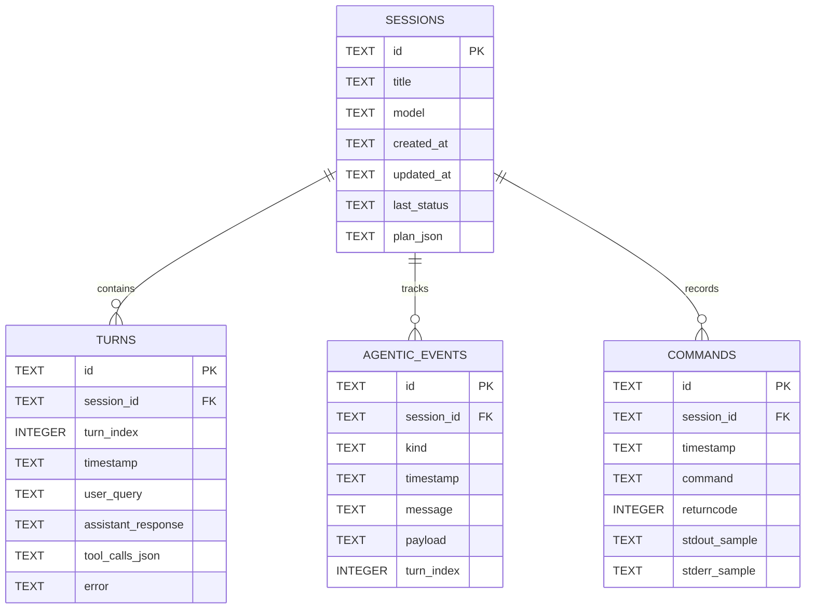

# 🌐 Cloudflare D1 Database Setup Guide for Kratos Agent

Kratos Agent stores all conversation sessions, turns, tool execution history, and autonomous agentic trace events in **Cloudflare D1**.

Cloudflare D1 is a globally distributed, serverless relational database built on SQLite. Kratos Agent connects to Cloudflare D1 directly via Cloudflare's secure REST API, requiring **no heavy external database drivers** or complex networking.

---

## 🚀 Quick Setup (Two Options)

You can set up your Cloudflare D1 database either through the **Cloudflare Web Dashboard** or using the **Wrangler CLI**.

---

### Option A: Via Cloudflare Web Dashboard (Visual UI)

#### Step 1: Log in to Cloudflare
1. Go to [https://dash.cloudflare.com](https://dash.cloudflare.com) and log in (or create a free Cloudflare account).

#### Step 2: Retrieve your Cloudflare Account ID
1. In the Cloudflare dashboard, look at the right sidebar of the **Account Overview** page or click on any domain/Worker.
2. Under **Account Details**, copy your **Account ID** (a 32-character hexadecimal string, e.g. `a1b2c3d4e5f67890abcdef1234567890`).

#### Step 3: Create a D1 Database
1. In the left navigation menu, navigate to **Storage & Databases** → **D1 SQL Database**.
2. Click **Create Database**.
3. Set the database name to: `kratos-db` (or any name of your choice).
4. Select your preferred geographic region (e.g., `North America`, `Europe`, or `Asia-Pacific`).
5. Click **Create**.
6. On the database details page, copy the **Database ID** (UUID format, e.g. `12345678-abcd-1234-abcd-1234567890ab`).

#### Step 4: Create an API Token
1. In the top-right corner of the Cloudflare Dashboard, click your profile avatar and select **My Profile** → **API Tokens** (or go directly to [https://dash.cloudflare.com/profile/api-tokens](https://dash.cloudflare.com/profile/api-tokens)).
2. Click **Create Token**.
3. Under **Custom Token**, click **Get started**.
4. Configure token permissions:
   - **Token Name**: `kratos-agent-d1-token`
   - **Permissions**:
     - `Account` → `D1` → `Edit`
   - **Account Resources**:
     - `Include` → `All accounts` (or select your specific account)
5. Click **Continue to summary**, then **Create Token**.
6. Copy your **API Token** immediately (Cloudflare will only display it once).

---

### Option B: Via Wrangler CLI (Fastest for Developers)

If you have Node.js and Wrangler installed:

```bash
# 1. Authenticate with Cloudflare
npx wrangler login

# 2. Create the D1 Database
npx wrangler d1 create kratos-db
```

Wrangler will output:
```text
[[d1_databases]]
binding = "DB"
database_name = "kratos-db"
database_id = "xxxxxxxx-xxxx-xxxx-xxxx-xxxxxxxxxxxx"
```

Copy the `database_id` and your Cloudflare `account_id` from `npx wrangler whoami`.

---

## ⚙️ Step 5: Configure Kratos Agent `.env`

In your Kratos Agent workspace directory (`c:\Users\thiru\Documents\Kratos_Agent`), edit or create your `.env` file and add the following:

```env
# ==============================================================================
# Cloudflare D1 Database Configuration
# ==============================================================================
CLOUDFLARE_ACCOUNT_ID=your_account_id_here
CLOUDFLARE_D1_DATABASE_ID=your_database_id_here
CLOUDFLARE_API_TOKEN=your_cloudflare_api_token_here
```

> [!NOTE]
> If these variables are not provided or if you are working offline, Kratos Agent will automatically and seamlessly fall back to a **Local D1 SQLite Mirror** located at `.kratos/kratos_d1.db` with identical schema and query semantics. Zero downtime, zero broken workflows!

---

## 🛠️ Step 6: Initialize Schema & Migrate Past Sessions

Run the built-in Kratos D1 initialization and migration command:

```powershell
.venv\Scripts\python.exe -m kratos_agent.tools.d1_setup --migrate
```

This will:
1. Verify the connection to Cloudflare D1.
2. Automatically execute [src/kratos_agent/core/d1_schema.sql](file:///c:/Users/thiru/Documents/Kratos_Agent/src/kratos_agent/core/d1_schema.sql) to create:
   - `sessions` table (with metadata, model, status, and JSON plan)
   - `turns` table (with user query, tool calls, assistant response)
   - `agentic_events` table (with full execution trace events and payloads)
   - `commands` table (with terminal execution records and exit codes)
3. Migrate any legacy JSON session files from `.kratos/sessions/` and `.kratos/events.jsonl` into Cloudflare D1.

---

## 🖥️ Step 7: Launch the Web Console & Trace Inspector

You can inspect all chat conversations, tool executions, agentic trace replays, and execute custom SQL queries directly in the web browser:

### Option 1: From the Kratos Interactive CLI
Start Kratos Agent:
```powershell
.venv\Scripts\python.exe -m kratos_agent.cli
```
Inside the CLI, type:
```text
/web
```
This will launch the embedded web server at `http://127.0.0.1:7860` and automatically open your default browser.

You can also check database connection status at any time in the CLI:
```text
/d1
```

### Option 2: Standalone Web Server
Run directly from terminal:
```powershell
.venv\Scripts\python.exe -m kratos_agent.web.server --port 7860
```

---

## 📊 Database Relational Schema Overview


